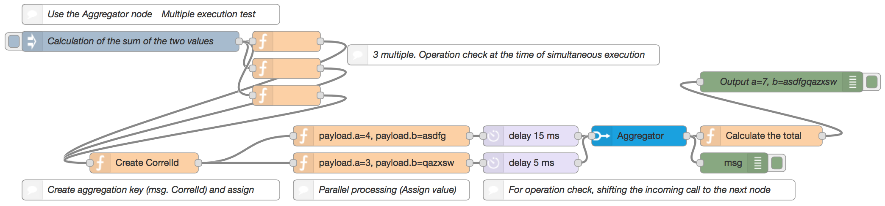

# node-red-contrib-message-aggregator

Node Red Node to aggregate messages from multiple nodes.  

## How to Install

Run the following command in the root directory of your Node-RED install

```
npm install node-red-contrib-message-aggregator
```

## How to Use

### Aggregator Node settings are as follows:
- Aggregations : To set the incoming waiting number of messages that the aggregation target.

### Input message of Aggregator Node in the following:
- msg.CorrelId : Aggregation ID. The message you want to aggregate, it is necessary to set the same key.

### Output message of Aggregator Node in the following:
- msg.payload : Array list. Within the aggregation array, it has been each of the payload assignment.

## Sample Flow

```
[{"id":"9691bd80.696e4","type":"comment","z":"d9b2b329.264d5","name":"Use the Aggregator node　Multiple execution test","info":"","x":250,"y":360,"wires":[]},{"id":"6851074f.97aef8","type":"function","z":"d9b2b329.264d5","name":"payload.a=4, payload.b=asdfg","func":"msg.payload = {\n    'a' : 4,\n    'b' : \"asdfg\"\n};\n\n\nreturn msg;","outputs":1,"noerr":0,"x":590,"y":540,"wires":[["ffd1ba6c.002e48"]]},{"id":"1a70e05e.e58f2","type":"function","z":"d9b2b329.264d5","name":"payload.a=3, payload.b=qazxsw","func":"msg.payload = {\n    'a' : 3,\n    'b' : \"qazxsw\"\n};\n\n\nreturn msg;","outputs":1,"noerr":0,"x":590,"y":580,"wires":[["6736b192.98c95"]]},{"id":"df072db.f20f8d","type":"function","z":"d9b2b329.264d5","name":"Create CorrelId","func":"\nvar uuid = (function(){\n    var S4 = function() {\n        return (((1+Math.random())*0x10000)|0).toString(16).substring(1);\n    };  \n    return (S4()+S4()+\"-\"+S4()+\"-\"+S4()+\"-\"+S4()+\"-\"+S4()+S4() +S4());\n})();\n\n\nmsg.CorrelId = uuid;\n\nreturn msg;","outputs":1,"noerr":0,"x":240,"y":580,"wires":[["6851074f.97aef8","1a70e05e.e58f2"]]},{"id":"ae5dd936.51a228","type":"comment","z":"d9b2b329.264d5","name":"Parallel processing (Assign value)","info":"","x":590,"y":620,"wires":[]},{"id":"c31752d9.3ce8b","type":"comment","z":"d9b2b329.264d5","name":"3 multiple. Operation check at the time of simultaneous execution","info":"","x":770,"y":420,"wires":[]},{"id":"ffd1ba6c.002e48","type":"delay","z":"d9b2b329.264d5","name":"","pauseType":"delay","timeout":"15","timeoutUnits":"milliseconds","rate":"1","rateUnits":"second","randomFirst":"1","randomLast":"5","randomUnits":"seconds","drop":false,"x":810,"y":540,"wires":[["908b2c03.6f74d"]]},{"id":"6736b192.98c95","type":"delay","z":"d9b2b329.264d5","name":"","pauseType":"delay","timeout":"5","timeoutUnits":"milliseconds","rate":"1","rateUnits":"second","randomFirst":"1","randomLast":"5","randomUnits":"seconds","drop":false,"x":810,"y":580,"wires":[["908b2c03.6f74d"]]},{"id":"c592ca89.3a6d38","type":"function","z":"d9b2b329.264d5","name":"","func":"\nreturn msg;","outputs":1,"noerr":0,"x":450,"y":400,"wires":[["df072db.f20f8d"]]},{"id":"a41cf36e.5be31","type":"function","z":"d9b2b329.264d5","name":"","func":"\nreturn msg;","outputs":1,"noerr":0,"x":450,"y":440,"wires":[["df072db.f20f8d"]]},{"id":"711ec566.8ee13c","type":"function","z":"d9b2b329.264d5","name":"","func":"\nreturn msg;","outputs":1,"noerr":0,"x":450,"y":480,"wires":[["df072db.f20f8d"]]},{"id":"b43557ce.4bcaa8","type":"comment","z":"d9b2b329.264d5","name":"Create aggregation key (msg. CorrelId) and assign","info":"","x":250,"y":620,"wires":[]},{"id":"fad2f2b3.052d1","type":"comment","z":"d9b2b329.264d5","name":"For operation check, shifting the incoming call to the next node","info":"","x":970,"y":620,"wires":[]},{"id":"908b2c03.6f74d","type":"Aggregator","z":"d9b2b329.264d5","name":"","aggregations":2,"x":970,"y":540,"wires":[["7687a558.89785c","acafbc5.f53504"]]},{"id":"5a65edbf.a59a14","type":"inject","z":"d9b2b329.264d5","name":"Calculation of the sum of the two values","topic":"","payload":"","payloadType":"date","repeat":"","crontab":"","once":false,"x":220,"y":400,"wires":[["c592ca89.3a6d38","a41cf36e.5be31","711ec566.8ee13c"]]},{"id":"7687a558.89785c","type":"function","z":"d9b2b329.264d5","name":"Calculate the total","func":"var result = {\n    'a' : msg.payload[0].a + msg.payload[1].a,\n    'b' : msg.payload[0].b + msg.payload[1].b\n};\n\nmsg.payload = result;\n\n\nreturn msg;","outputs":1,"noerr":0,"x":1150,"y":540,"wires":[["a4a866d2.5b5798"]]},{"id":"a4a866d2.5b5798","type":"debug","z":"d9b2b329.264d5","name":"Output a=7, b=asdfgqazxsw","active":true,"console":"false","complete":"payload","x":1180,"y":460,"wires":[]},{"id":"acafbc5.f53504","type":"debug","z":"d9b2b329.264d5","name":"","active":true,"console":"false","complete":"true","x":1110,"y":580,"wires":[]}]
```

## Reference info
(Sorry It is Japanese)  
http://niccloud.niandc.ne.jp/?p=2363


## Copyright and license

Copyright (c) 2016 Kota Suizu  
Released under the MIT license  
http://opensource.org/licenses/mit-license.php
